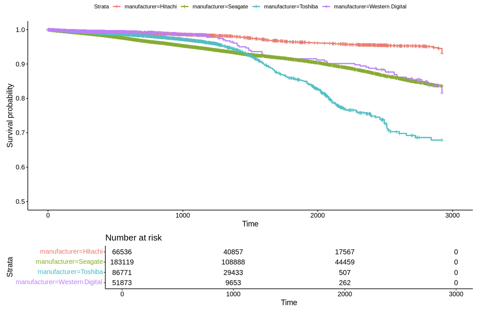

## Survival analysis and lifespan modeling

Hard disk drives are essential storage devices used in computers and servers. Selecting the right hard drive is important and challenging because hard disk can lead to data loss and operational disruptions. A cloud storage and backup company, Backblaze has provided quality source data and summary statistics of hard drive failure rates from their datacenter. This report applies survival analysis techniques to uncover patterns and inform storage infrastructure decisions.

* The analysis draws from [Backblaze's Hard Drive Data and Stats](https://www.backblaze.com/cloud-storage/resources/hard-drive-test-data) from 2016-2023, these logs capture daily snapshots of optional drive and their S.M.A.R.T. (Self-Monitoring, Analysis, and Reporting Technology) statistics reported by that drive.
* After preprocessing steps, the dataset comprises 388,299 unique drive combinations from Hitachi, Toshiba, Western Digital, and Seagate, the top 4 manufacturers from their logs.
* The analysis is conducted using R's survival analysis packages ‘survival’, ‘survminer’, ‘gtsummary’
* The nonparametric method Kaplan-Meier estimation and semi-parametric method Cox regression are employed to examine how manufacturer, drive capacity, and SMART attributes influence drive reliability.

    

    

